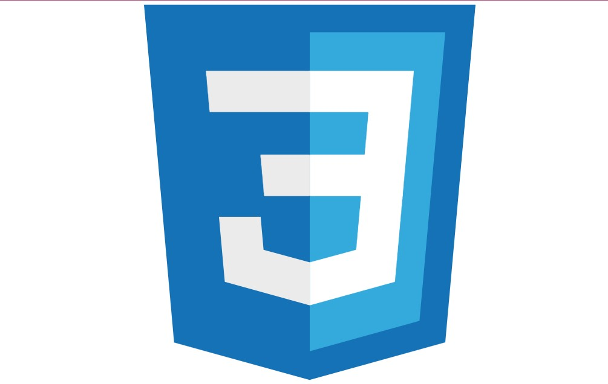
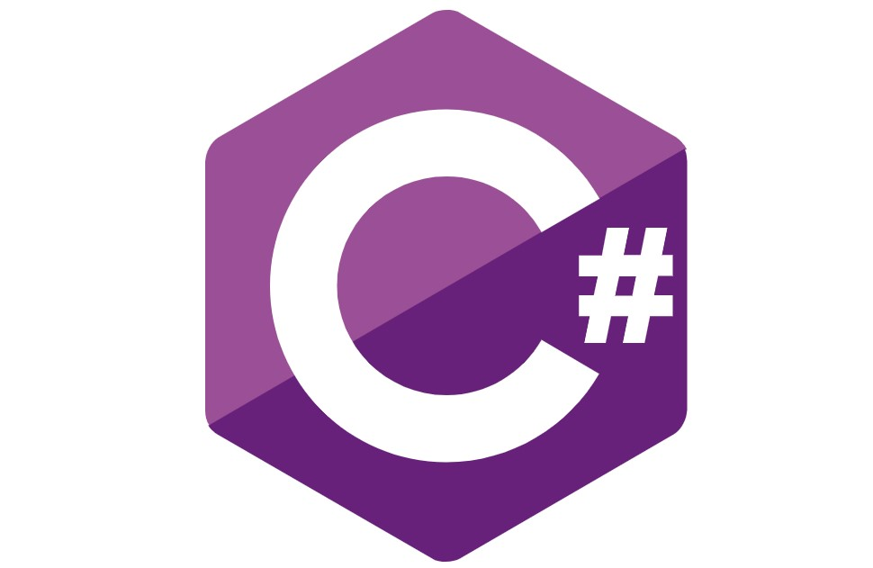

### Oi eu sou a Sabrina Souza, Estagiário de Dev Web! 👋

- 🔭 Atual Estou Estagiando na defensoria Publica do Estado do Pará na área da tecnologia em desenvolvimento Web.
- 🌱 Estou Aprendendo HTML, CSS, javascript, Python, C#, 

  <a href="https://github.com/SabrinaSouzaDev">
  
  

 
  
  <!---->
  <!---->
  
  
  
  
  

  
  ##
 

 
  
  
 	<!---->

  
   
 

