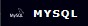

<h1 align=center> Bem-vindo ao meu github</h1>

### Oi eu sou a Sabrina Souza, Estagiário de Dev Web! 👋

- 🔭 Atualmente Estou Estagiando na defensoria Publica do Estado do Pará na área da tecnologia em desenvolvimento Web.
- 🌱 Estou Aprendendo HTML, CSS, javascript, Python, TypeScript. Node.js | React | Postgres | Docker / Compose | Django 
- 🎲 Meu inglês é Basico. 
- 💻 Estudo programação por conta própria, através de videoaulas e documentação. 

  <h2 align="left"> 💻 Habilidades | Skills </h2>

 
  
  <!---->
  <!---->
  
  
  
  
  
  
  

  
  

  

 <h2 style="align="center"> Estou interessada</h2>
  
  
  
  

 

<h2> Contato </h2>

 
  
 	<!---->

  
   
 
  
 

 

